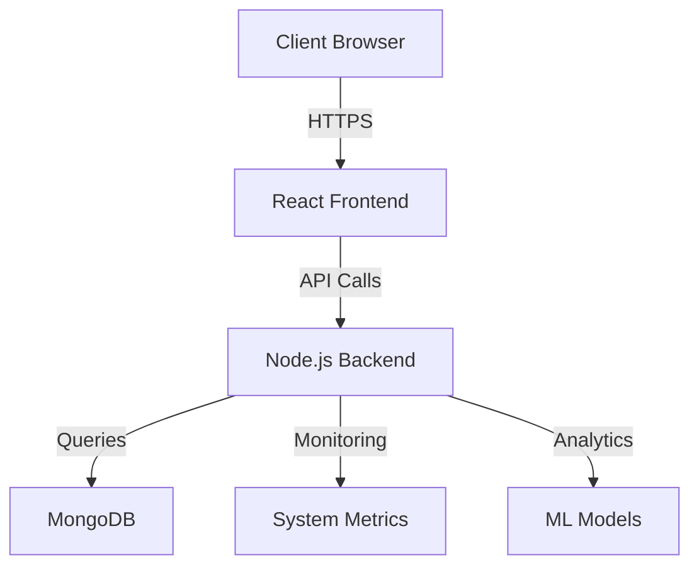

# Technical Specifications

## Architecture Overview



## Technology Stack

### Frontend
- React 18.2.0
- Material-UI 5.0.0
- Recharts 2.6.2
- Axios for HTTP requests

### Backend
- Node.js 16.x
- Express 4.18.2
- MongoDB Driver 4.x
- JWT Authentication

### Database
- MongoDB 5.0
- Indexes on:
  - transactions.date
  - transactions.category
  - transactions.type

### Security Features
- CORS Protection
- Rate Limiting
- Input Validation
- XSS Prevention
- JWT Authentication

## Machine Learning Components

### Prediction Model
```python
Model Architecture:
├── Input Layer
│   └── Features: [transaction_amount, category, date]
├── Processing
│   ├── Data Normalization
│   ├── Time Series Analysis
│   └── Category Encoding
└── Output
    ├── Spending Predictions
    └── Confidence Scores
```

### Data Processing Pipeline
```
Raw Data → Cleaning → Normalization → Feature Extraction → Model Input
```

## Database Schema

### Transactions Collection
```json
{
  "_id": ObjectId,
  "userId": String,
  "type": String,
  "amount": Number,
  "category": String,
  "description": String,
  "date": Date,
  "createdAt": Date,
  "updatedAt": Date
}
```

### Budgets Collection
```json
{
  "_id": ObjectId,
  "category": String,
  "amount": Number,
  "period": String,
  "currentSpent": Number,
  "createdAt": Date
}
```

## API Specifications

### Authentication
```json
Headers: {
  "Authorization": "Bearer <jwt_token>",
  "Content-Type": "application/json"
}
```

### Error Handling
```json
{
  "status": 400-500,
  "message": "Error description",
  "code": "ERROR_CODE",
  "details": {...}
}
```